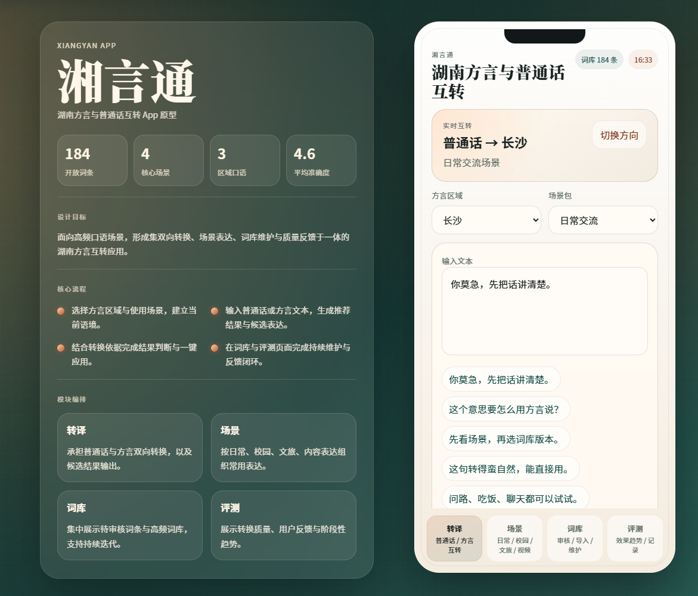
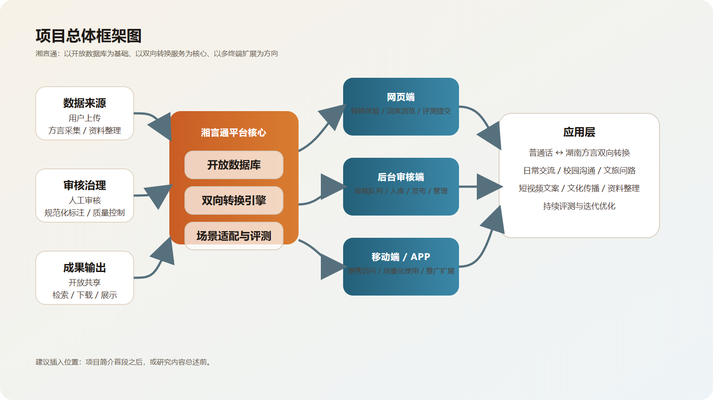
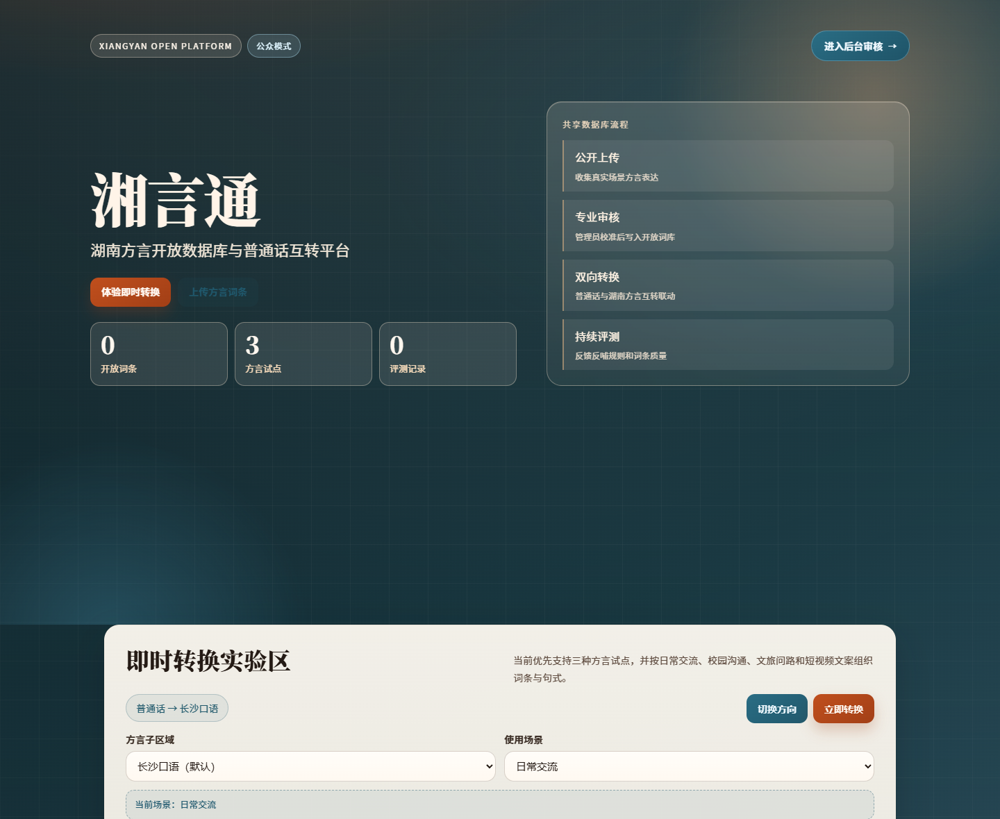
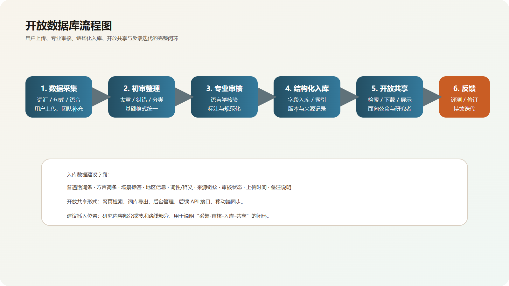
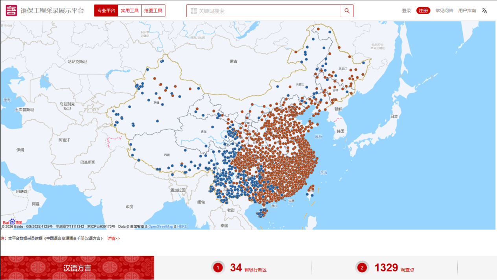
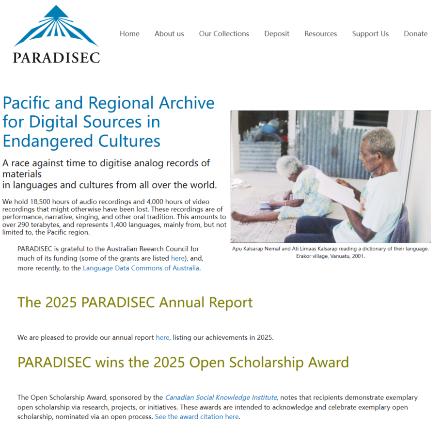
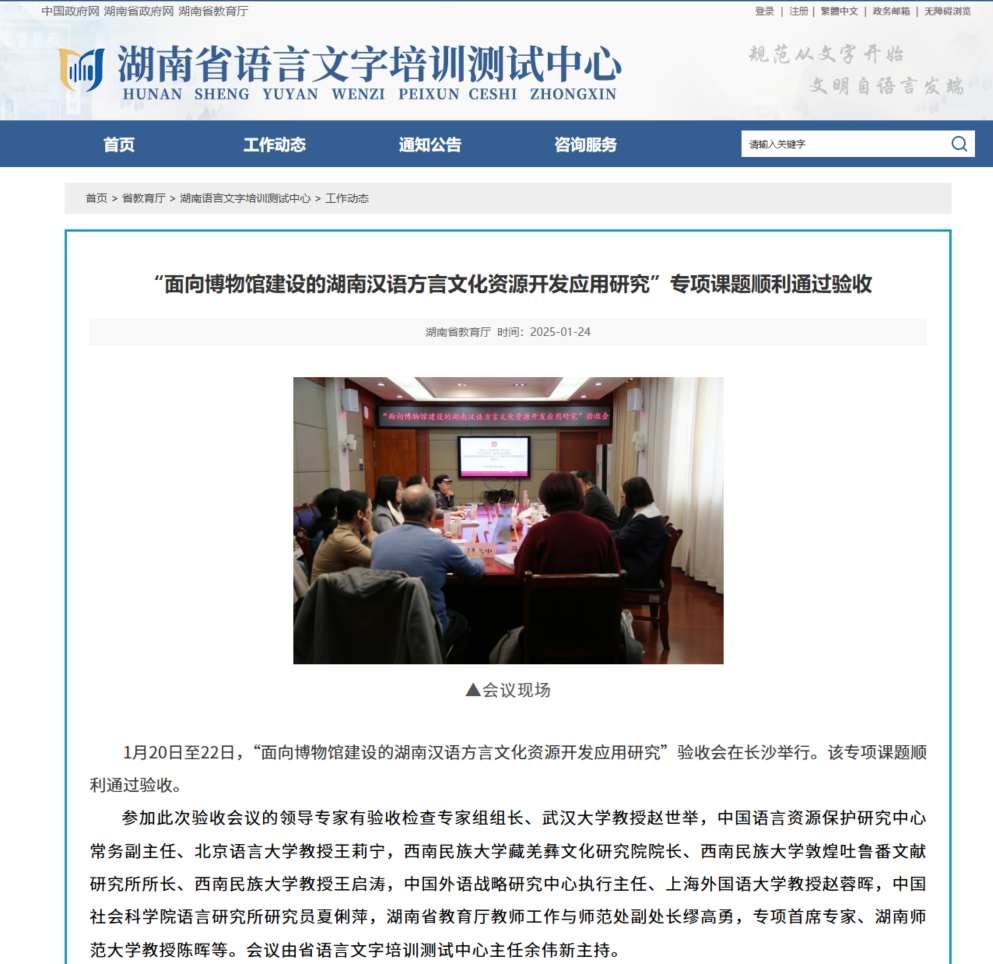
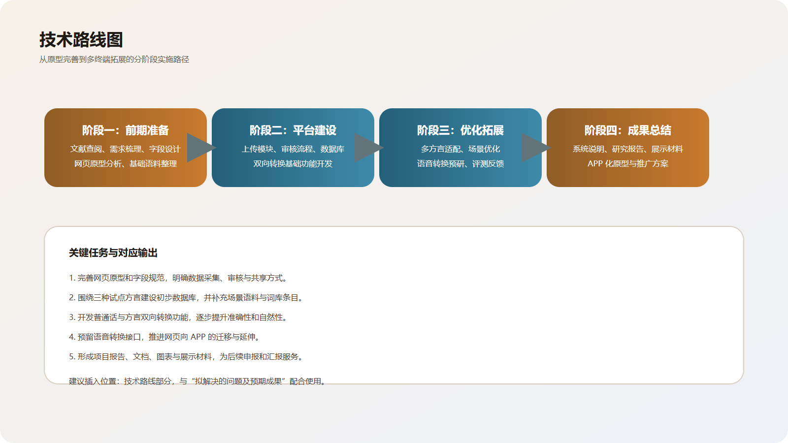

# 立项依据

## （一）项目简介

本项目拟建设“湘言通”湖南方言与普通话双向转换及开放语料数据库平台，以湖南地区方言资源的数字化整理、规范化存储与共享应用为主要研究对象，围绕“方言资源库建设”和“方言转换服务实现”两方面展开研究与实践。项目依托现有网页原型，在既有功能基础上，进一步完善数据采集、人工审核、结构化入库、双向转换、共享下载、场景适配和移动端延展等环节，逐步建成一个兼顾研究、展示与应用的方言数字平台。

近年来，国家持续推进语言文字信息化建设、文化资源数字化建设和语言资源保护工程，明确提出要加强数字中文建设，提升语言资源的数字化水平和服务能力[1-5]。这说明，方言资源的整理、保存与应用，已经不再只是传统语言调查中的附属工作，而是与数字中国建设、文化数字化战略以及国家语言资源保护工作紧密相关。围绕湖南方言建设开放数据库和转换平台，具有较为明确的现实基础和政策支撑。

湖南方言中大量词汇、句式和口语表达，至今仍分散于个体记忆、地方口述材料、网络文本、日常交流以及专业词典、地方语言研究书籍等资料之中，缺乏统一、规范且可持续更新的整理机制。现有材料来源零散、字段不统一，难以沉淀为可长期使用的公共资源。普通用户、方言学习者、研究人员和开发者，在理解、检索、转换和比对方言时又普遍存在现实需求，但现有工具大多停留在静态展示或零散查询层面，缺少以数据库为支撑、以服务为导向的综合平台。

因此，本项目并非仅仅制作一个简单的演示网页，而是希望在数据库建设的基础上，逐步形成“数据采集—人工审核—资源入库—双向转换—评测反馈—后续拓展”的完整工作链条。通过这一平台，可以在方言资源保护、方言数字化服务与地方文化传播之间建立起较为清晰的联系。当前 APP 原型演示地址为 `https://courageous-conkies-6dd293.netlify.app/`，也为后续移动端延伸提供了现成基础，其原型界面如图 1 所示。本项目总体框架如图 2 所示。

**图1 APP 原型首页界面**

**图2 项目总体框架图**

为说明项目已有的实现基础，现有网页平台首页界面如图 3 所示。该原型已能够展示方言与普通话双向转换、场景化表达、词库管理和评测反馈等内容，说明项目在功能构思和界面实现方面已完成前期探索。

**图3 湘言通网页平台首页界面**

## （二）研究目的

本项目的总体目标，是面向实际使用需求，建设一个集“方言数据采集、审核整理、开放共享、双向转换和持续扩展”于一体的湖南方言数字化平台，推动地方方言资源由分散保存逐步走向规范整理、集中管理和便捷应用。

本项目主要有以下四个目标。

1. 建设具有开放性和持续积累能力的湖南方言数据库。围绕词汇、短语、句式、语音样本、场景标签、释义和来源等信息，形成结构清晰、可逐步扩充的资源库。
2. 实现普通话与湖南方言之间的双向转换。通过词汇映射、句式转换和场景适配，降低用户理解和使用湖南方言的门槛。
3. 形成便于后续扩展的平台结构。以现阶段的三种试点方言为基础，为后续继续纳入更多方言点、增加语音功能和开发移动端应用预留空间。
4. 探索“数据库建设 + 语言服务平台 + 移动端延伸”相结合的实现路径，使方言保护工作由静态保存进一步走向动态服务和持续应用。

为使研究目标更加明确，可将本项目的目标分解为表 1。

**表1 项目目标分解表**

| 目标维度 | 核心任务 | 预期效果 |
| --- | --- | --- |
| 数据资源建设 | 建设方言词汇、句式、语音与场景标签数据库 | 形成可持续更新的开放资源底座 |
| 平台功能建设 | 实现普通话与方言双向转换、词条上传、审核与检索 | 提升平台的服务能力和使用价值 |
| 质量保障建设 | 引入后台审核和评测反馈机制 | 保证数据可靠性和结果可用性 |
| 应用拓展建设 | 推进多方言扩展、语音预研和 APP 原型延伸 | 提高项目推广潜力与长期发展空间 |

## （三）研究内容

本项目的研究内容主要包括以下四个方面。

### 1. 开放方言数据库建设与管理机制研究

本部分主要围绕湖南方言词汇、常用短语、句式表达、语音样本、场景标签、释义说明、来源信息和审核状态等内容，设计结构化的数据组织方式，并形成支持上传、审核、入库、检索和导出的数据库管理机制。数据库来源不仅包括用户上传和实地整理所得材料，也包括专业词典、方言研究著作、地方文献资料等相对稳定的书面记录。平台拟采用“多来源采集 + 后台审核 + 结构化入库”的工作方式，在保持开放性的同时，尽可能保证数据质量。数据库建设的基本流程如图 4 所示。

**图4 开放数据库建设流程图**

为增强数据库设计的规范性，本项目拟采用表 2 所示的核心字段结构。

**表2 数据库核心字段设计表**

| 字段名 | 含义 | 是否必填 | 示例 |
| --- | --- | --- | --- |
| 普通话词 | 标准汉语词条 | 是 | 漂亮 |
| 方言词 | 对应湖南方言表达 | 是 | 标致 |
| 方言点 | 所属区域或口音点 | 是 | 长沙 |
| 场景标签 | 使用场景分类 | 否 | 日常交流 |
| 释义 | 词义说明 | 否 | 外貌好看 |
| 来源 | 数据采集来源 | 否 | 用户上传/调查/专业词典/文献 |
| 审核状态 | 当前审核状态 | 是 | 待审/通过/驳回 |

### 2. 方言与普通话双向转换功能研究

本部分围绕普通话转方言、方言转普通话两个方向展开研究，重点处理词汇对应、句式转换、语义近似表达和场景适配等问题。由于方言表达具有较强的地域差异和语境依赖，转换过程不能仅依赖简单的词典替换，还需要结合常见场景、候选表达和解释反馈，共同优化转换结果。已有研究表明，低资源语言或方言技术通常需要先建立较为稳定的数据基础，再逐步完善转换和评测机制[10-12]，这一思路与本项目当前阶段的研究安排基本一致。

### 3. 多方言接入与功能扩展研究

目前，项目优先选择长沙、湘潭、株洲三类试点方言，在此基础上构建可扩展的数据模型与功能模块，为后续接入更多湖南方言点提供统一框架。同时，项目将预留语音转换与语音互转的扩展接口，以适应后续由文本服务向“文本 + 语音”服务延伸的需要。就现阶段而言，本项目更重视资源组织方式、字段规范和扩展机制的稳定性，而不是在一开始就追求复杂算法的实现。

### 4. 多终端应用与推广场景研究

本项目将在现有网页原型基础上，继续优化交互流程、数据管理方式和展示逻辑，并结合移动端使用场景推进 APP 化原型研究，使系统更适合手机用户在日常交流、文旅传播、学习理解和资料整理中的高频使用。已有语言资源平台的实践表明，资源建设若要真正形成社会触达能力，往往还需要配合较为清晰的展示逻辑和服务入口[13-15]。

## （四）国内外研究现状和发展动态

### 1. 国内研究现状

国内关于汉语方言的研究，已由传统的语音、词汇、声调和分区研究，逐步扩展到语言生态、社会认同、资源保护工程和数字化整理等方向[6-9]。尤其是中国语言资源保护工程的持续推进，说明我国在方言和地方语言资源的记录、整理、保存、展示和开发利用等方面，已经形成较为系统的工作基础[5][6]。这为本项目提供了较为明确的研究背景和方法参考。

国家语言资源服务平台、中国语言资源采录展示平台和中国语言文字数字博物馆等平台，已经体现出“资源采集、成果展示、公共传播和服务聚合”相结合的发展趋势，说明语言资源建设正由单纯保存逐步转向“保存 + 展示 + 服务”的综合模式。相关平台示例如图 5、图 6 和图 7 所示。

**图5 国家语言资源服务平台首页**

**图6 中国语言资源采录展示平台首页**

**图7 中国语言文字数字博物馆首页**

### 2. 国外研究现状

国际上关于低资源语言和方言技术的研究，主要集中在如何在数据有限的条件下建设资源、定义任务、建立基线系统并持续优化[10-12]。无论是词典型数据集、语音识别数据集，还是方言翻译系统，许多研究都表明，数据建设仍然是后续算法和服务实现的前提。

在平台建设方面，PARADISEC、ELAR、The Language Archive 等国际语言资源平台，普遍重视长期归档、元数据管理、资源检索和共享机制。这些经验对于本项目后续在数据库组织、分类检索和资源开放等方面都具有参考价值。其中，PARADISEC 平台如图 8 所示。

**图8 PARADISEC 平台首页**

### 3. 现有研究的不足

现有研究和现有平台仍存在以下几方面不足。

1. 许多研究仍然是单点推进，如只做词典、只做语音识别或只做句子翻译，缺少将“采集、审核、入库、转换、评测、迭代”串联起来的完整闭环。
2. 面向湖南方言的公开可用数据、统一标注规范、多方言扩展机制和普通话双向转换基础仍不够成熟。
3. 同时兼顾数据库建设、公众服务和移动端延展的综合型平台仍较少，区域方言的数字服务能力仍有提升空间。

为使现状分析更加直观，可将典型平台与本项目的关系整理为表 3。

**表3 相关平台与本项目对比表**

| 平台/项目 | 主要特点 | 现有优势 | 局限性 | 对本项目的启示 |
| --- | --- | --- | --- | --- |
| 国家语言资源服务平台 | 资源服务聚合 | 国家级、权威性高、服务导向明显 | 地方方言定制化不强 | 借鉴“资源库 + 服务平台”一体化思路 |
| 中国语言资源采录展示平台 | 采录与展示结合 | 贴近采集、展示、检索链路 | 偏展示型，转换服务有限 | 借鉴采录展示和结构化入库机制 |
| 中国语言文字数字博物馆 | 公共传播与数字展示 | 多模态、适合文化传播 | 语言服务属性相对较弱 | 借鉴数字展示和传播方式 |
| PARADISEC | 国际语言档案平台 | 长期保存、元数据规范 | 本土应用场景较远 | 借鉴归档、分类和共享模式 |
| 湘言通 | 湖南方言数据库与转换平台 | 兼顾数据库、转换、审核和扩展 | 仍处于建设完善阶段 | 形成区域方言平台化综合方案 |

### 4. 本项目的切入点

在上述研究基础上，本项目希望立足湖南方言的实际应用场景，将资源整理、平台建设和转换服务结合起来推进。项目的切入点不在于单一算法展示，而在于通过开放数据库解决资源沉淀问题，通过双向转换回应现实使用需求，通过后台审核和评测反馈提升平台质量，并在此基础上逐步向移动端延伸。与单纯展示型平台相比，本项目更强调“可积累、可维护、可扩展、可使用”。

## （五）创新点与项目特色

本项目的主要特色和创新点可概括为以下几个方面。

1. 以开放数据库建设为核心。项目并非仅做静态展示，而是尝试建立一个可持续积累、可审核、可共享的湖南方言资源库。
2. 以双向转换为主要应用场景。将普通话与湖南方言之间的转换需求纳入同一平台，增强项目的现实使用价值。
3. 以“用户上传 + 后台审核 + 评测反馈”构建闭环。既重视开放参与，也注重质量控制和后续优化。
4. 以多终端和后续扩展为发展方向。在保留网页端展示和管理能力的同时，为多方言接入和语音转换预留空间，增强项目的持续发展能力。

此外，湖南本地已有相关方言文化资源开发实践，这也从侧面说明本项目的选题具有一定的区域基础和现实可行性。地方实践案例如图 9 所示。

**图9 湖南省教育厅方言资源开发应用研究新闻页**

## （六）技术路线、拟解决的问题及预期成果

### 1. 技术路线

本项目拟按照“平台原型完善—数据库结构设计—数据采集上传—专业审核入库—双向转换优化—多终端拓展”的技术路线推进实施。整体技术路线如图 10 所示。

**图10 技术路线图**

具体内容如下：

1. 在现有网页原型基础上，进一步完善系统架构与交互逻辑，明确字段规范、上传规范、审核流程和共享方式。
2. 围绕三种已纳入考虑的方言，整理基础语料和场景表达，建设初步数据库。
3. 开发并优化普通话与方言之间的双向转换功能，提升系统对实际场景的适配能力。
4. 预留语音转换模块接口，为后续实现方言与普通话之间的语音互转做准备。
5. 结合移动端设计思路，推进 APP 原型研究与后续产品延伸。

### 2. 拟解决的问题

本项目拟重点解决表 4 所示问题。

**表4 拟解决问题与对应方案表**

| 现存问题 | 问题表现 | 对应方案 | 预期效果 |
| --- | --- | --- | --- |
| 方言资源分散 | 数据来源零散、难以沉淀 | 建设统一上传与入库平台 | 提高数据积累效率 |
| 数据缺乏规范 | 字段不统一、来源不清晰 | 建立审核机制和字段标准 | 提高数据可用性与可信度 |
| 转换工具功能单一 | 仅展示、不支持闭环服务 | 构建双向转换、评测反馈和候选解释 | 提升平台服务价值 |
| 移动端应用不足 | 网页端难覆盖高频场景 | 推进 APP 原型和移动端适配 | 提高项目触达和推广能力 |

### 3. 预期成果

本项目的预期成果主要包括：

1. 形成一个较为完整的湖南方言与普通话双向转换网页平台。
2. 建设一个支持用户上传、专业审核、开放共享的方言数据库。
3. 完成三种试点方言的初步纳入与数据组织。
4. 形成语音转换功能的前期设计思路和扩展接口。
5. 完成网页向 APP 发展的产品原型方案。
6. 形成项目研究报告、系统说明文档和相关展示材料。

## （七）项目研究进度安排

项目研究拟分四个阶段推进，具体安排如表 5 所示。

**表5 项目研究进度安排表**

| 阶段 | 主要任务 | 阶段成果 |
| --- | --- | --- |
| 第一阶段：前期准备与资料整理 | 完成文献查阅、需求梳理、字段设计、网页原型分析和三种方言基础语料初步整理 | 需求分析稿、字段设计稿、基础语料清单 |
| 第二阶段：平台建设与功能开发 | 完善数据上传、后台审核、数据库管理和双向转换等核心模块 | 可运行网页平台、初步数据库、审核流程 |
| 第三阶段：优化拓展 | 完善多方言适配、转换效果、共享机制和用户体验，推进语音预研和 APP 原型完善 | 优化版平台、扩展方案、APP 原型 |
| 第四阶段：总结提升 | 形成研究报告、系统说明和展示材料，总结经验与不足 | 结题材料、展示文档、项目总结 |

## （八）已有基础

本项目已经具备一定的前期基础。团队已完成网页原型的初步搭建，并形成了可展示的方言与普通话双向转换页面，说明项目在功能构思和界面实现方面已经迈出了实质性一步。围绕方言与普通话转换需求，团队也已开始整理相关词汇和表达内容，对平台的数据组织方式、功能结构和使用场景形成了初步认识。项目同时已经具备网页向 APP 延伸的思路和原型基础，当前 APP 原型演示地址为 `https://courageous-conkies-6dd293.netlify.app/`，能够为后续移动端开发提供参照。

此外，湖南本地已有相关方言文化资源开发和展示实践，这也说明本项目的选题具有一定的区域现实基础和推进条件。目前，项目在原型设计、功能方向、研究主题和应用场景等方面已经具备较为明确的前期准备，后续重点在于继续扩大数据来源、完善审核标准、增强多方言适配能力，并逐步推进语音功能和移动端延伸。

## 参考文献

[1] 教育部, 国家语委, 中央网信办. 教育部 国家语委 中央网信办关于加强数字中文建设 推进语言文字信息化发展的意见[EB/OL]. (2025-03-28)[2026-03-27]. https://www.gov.cn/zhengce/zhengceku/202503/content_7016543.htm.

[2] 全国人民代表大会常务委员会. 中华人民共和国国家通用语言文字法[EB/OL]. (2000-10-31)[2026-03-27]. https://www.npc.gov.cn/npc/c2/c30834/202512/t20251227_450731.html.

[3] 中共中央办公厅, 国务院办公厅. 关于推进实施国家文化数字化战略的意见[EB/OL]. (2022-05-22)[2026-03-27]. https://www.gov.cn/zhengce/2022-05/22/content_5691759.htm.

[4] 中共中央, 国务院. 数字中国建设整体布局规划[EB/OL]. (2023-02-27)[2026-03-27]. https://www.gov.cn/zhengce/2023-02/28/content_5743484.htm.

[5] 教育部, 国家语委. 中国语言资源保护工程2024年度工作会议召开[EB/OL]. (2024-06-21)[2026-03-27]. https://www.moe.gov.cn/jyb_xfb/gzdt_gzdt/s5987/202406/t20240621_1137100.html.

[6] 曹志耘. 中国语言资源保护工程的定位、目标与任务[J]. 语言文字应用, 2015(4): 10-17. https://doi.org/10.16499/j.cnki.1003-5397.2015.04.002.

[7] 李如龙. 汉语方言学[M]. 北京: 高等教育出版社, 2001.

[8] 袁家骅. 汉语方言概要: 第2版[M]. 北京: 语文出版社, 2021.

[9] 石琳. 语言生态视域下的方言文化保护与传承[J]. 中华文化论坛, 2017(9): 140-145. https://zhwl.cbpt.cnki.net/portal/journal/portal/client/paper/5b7edcb64c8fe66e3a393363d36d27e7.

[10] Lau C M, Chan G W Y, Tse R K W, et al. Words.hk: A comprehensive Cantonese dictionary dataset with definitions, translations and transliterated examples[C/OL]//Proceedings of the Workshop on Dataset Creation for Lower-Resourced Languages within the 13th Language Resources and Evaluation Conference. Marseille, France: European Language Resources Association, 2022: 53-62[2026-03-27]. https://aclanthology.org/2022.dclrl-1.7/.

[11] Yu T, Frieske R, Xu P, et al. Automatic speech recognition datasets in Cantonese: A survey and new dataset[C/OL]//Proceedings of the Thirteenth Language Resources and Evaluation Conference. Marseille, France: European Language Resources Association, 2022: 6487-6494[2026-03-27]. https://aclanthology.org/2022.lrec-1.696/.

[12] Suen W, Chow K, Lam W. Leveraging Mandarin as a pivot language for low-resource machine translation between Cantonese and English[C/OL]//Proceedings of the Seventh Workshop on Technologies for Machine Translation of Low-Resource Languages. Macau, China: Association for Computational Linguistics, 2024: 74-84[2026-03-27]. https://aclanthology.org/2024.loresmt-1.8/.

[13] 国家语言资源服务平台[EB/OL]. [2026-03-27]. https://fw.ywky.edu.cn/.

[14] 中国语言资源采录展示平台[EB/OL]. [2026-03-27]. https://zhongguoyuyan.cn/.

[15] 中国语言文字数字博物馆[EB/OL]. [2026-03-27]. https://szyb.smartedu.cn/.
