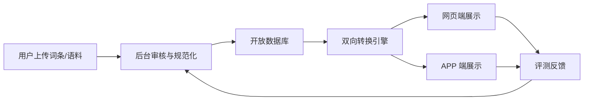
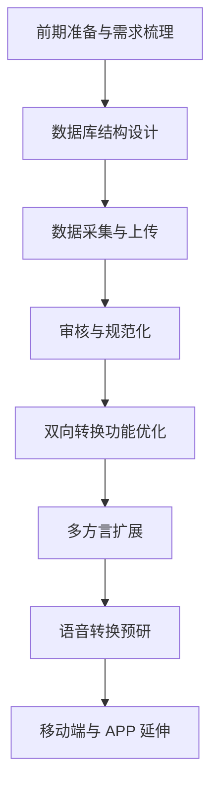
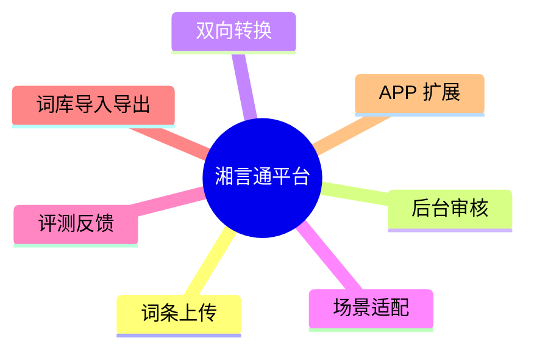

# 截图与图表草图

> 用途：给“立项依据”补充可直接插入申请书的截图素材与图表草图。  
> 截图文件已放在 `截图素材` 文件夹中，正文中可直接按图号引用。  
> 图表草图先给出结构骨架，后续可再用 Visio / PPT / draw.io 规范绘制。

## 一、截图索引

| 图号建议 | 文件名 | 来源 | 建议放在正文位置 | 备注 |
| --- | --- | --- | --- | --- |
| 图 1 | `01-湘言通首页.png` | 本项目首页 | （一）项目简介、（八）已有基础 | 最适合作为项目首页与现有基础展示。 |
| 图 2 | `02-APP原型首页.png` | 本项目 APP 原型 | （八）已有基础 | 适合作为移动端延伸能力的证明。 |
| 图 3 | `03-国家语言资源服务平台.png` | 国家语言资源服务平台 | （四）国内外研究现状与发展动态 | 适合作为国家级平台案例。 |
| 图 4 | `04-中国语言资源采录展示平台.png` | 中国语言资源采录展示平台 | （三）研究内容、（六）技术路线 | 适合作为采集-审核-入库链路对照。 |
| 图 5 | `05-中国语言文字数字博物馆.png` | 中国语言文字数字博物馆 | （一）项目简介、（五）创新点与项目特色 | 适合作为语言资源数字化展示案例。 |
| 图 6 | `06-湖南本地项目新闻页.png` | 湖南省教育厅新闻页 | （四）研究现状、（八）已有基础 | 适合作为湖南本地实践依据。 |
| 图 7 | `07-ELAR.png` | ELAR | （四）国内外研究现状与发展动态 | 适合作为国际语言档案平台案例。 |
| 图 8 | `08-PARADISEC.png` | PARADISEC | （四）国内外研究现状与发展动态 | 适合作为国际归档与保存平台案例。 |

## 二、图表草图

### 1. 项目总体框架图

### 2. 开放数据库建设流程图

### 3. 技术路线图

### 4. 功能模块图

### 5. 数据库字段草图

| 字段 | 含义 | 是否必填 | 示例 |
| --- | --- | --- | --- |
| 普通话词 | 标准汉语词条 | 是 | 漂亮 |
| 方言词 | 对应方言表达 | 是 | 标致 |
| 方言点 | 所属区域 | 是 | 长沙 |
| 场景标签 | 使用场景分类 | 否 | 日常交流 |
| 释义 | 词义说明 | 否 | 外貌好看 |
| 来源 | 采集来源 | 否 | 用户上传 / 文献 / 调查 |
| 审核状态 | 当前状态 | 是 | 待审 / 通过 / 驳回 |

## 三、建议后续正式出图顺序

1. 先画 `项目总体框架图` 和 `技术路线图`。
2. 再画 `开放数据库建设流程图` 与 `功能模块图`。
3. 最后补 `数据库字段草图` 和 `项目进度甘特图`。

## 四、备注

- 如果要把这组图表真正放进申请书，建议统一成同一种视觉风格。
- 截图可以直接作为“已有基础”和“案例对照”，图表则更适合放在“研究内容”和“技术路线”。

